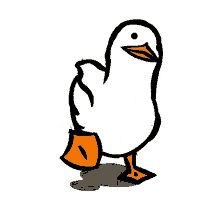

# Dryduck

Every programmer knows dry. Don't repeat yourself. So why repeat yourself across platforms, writing the same thing twice? Dryduck is a tool for code-sharing across cross-platform apps. It's a fork of [wml](https://github.com/wix/wml)

## Why?

Let's face it, sometimes symbolic links just aren't enough. Github has more than [10K issues](https://github.com/search?utf8=✓&q=support+for+symlinks&type=Issues) with the words "support for symlinks" in them.

Two examples I've encountered so far were: React Native's packager [lack of support for them](https://github.com/facebook/react-native/issues/637) and Webpack's [inability to find linked modules dependencies](http://webpack.github.io/docs/troubleshooting.html#npm-linked-modules-doesn-t-find-their-dependencies) (working around this has issues of its own). A lot of people resolve to working directly from the node*modules folder in these cases, but \_a.* if your package is required by two projects on which you are working simultaneously, you're screwed, and _b._ it just feels wrong.

Dryduck makes use of Facebook's ultra-fast Watchman to watch for changes in your source folder and copy them (and only them) into your destination folder. It makes it possible (unlike wml) to add relative paths into a settingsfile so that you can watch and copy folders across big monorepo's.

## Install

```sh
npm install dryduck
#or
yarn add dryduck

```

Also, make sure you have [watchman](https://facebook.github.io/watchman/docs/install.html) installed

```
brew update
brew install watchman
```

Then, add dryduck to your yarn scripts

```
scripts: {
    "dryduck": "dryduck",
    ...
}
```

## Usage

```sh
# add the link to dryduck using `yarn dryduck add <src> <dest>`
yarn dryduck add ~/my-package ~/main-project/node_modules/my-package
# start watching all links added
yarn dryduck start
```

## Commands

#### add

`yarn dryduck add <src> <dest>` (or `yarn dryduck a`)

Adds a link.

dryduck will not start listening to changes until you start it by running `dryduck start`.

Each link is given an unique id, you can see all links and their ids by running `dryduck list`.
Links are saved to `src/links.json` in your `dryduck` install directory, meaning that
your configuration is specific to that `dryduck` install.

#### rm

`yarn dryduck rm <linkId>`

Removes a link. Passing `all` as linkId removes all links.

#### start

`yarn dryduck start` (or `yarn dryduck s`)

Starts dryduck.

It first copies all watched files from source to destination folder and then waits for new changes to happen.

#### list

`yarn dryduck list` (or `yarn dryduck ls`)

Lists all links.

Shows each link's id, state and source/destination folders.

#### enable

`yarn dryduck enable [linkId]` (or `yarn dryduck en`)

Enables a link. Passing `all` as linkId enables all links.

If you don't specify a linkId dryduck will open in interactive mode.

#### disable

`yarn dryduck disable [linkId]` (or `yarn dryduck d`)

Disables a link. Passing `all` as linkId disabled all links.

If you don't specify a linkId dryduck will open in interactive mode.

Great for re-using old links without having to type them over and over again.

## Miscellaneous

#### Ignored folders

When adding a new link dryduck will try to detect if your source folder is a git repository or an npm package, it will then offer to ignore the ".git" and "node_modules" folders for you.

If you want to add more folders to your ignored folders first create a file named `.watchmanconfig` in your source folder, this file should contain Watchman's configuration for this folder. See example below to learn how populate it or check out the [Watchman docs](https://facebook.github.io/watchman/docs/config.html) to learn more about Watchman configurations.

In the following example we are ignoring the ".git" and "node_modules" folders:

```json
{
    "ignore_dirs": [".git", "node_modules"]
}
```
